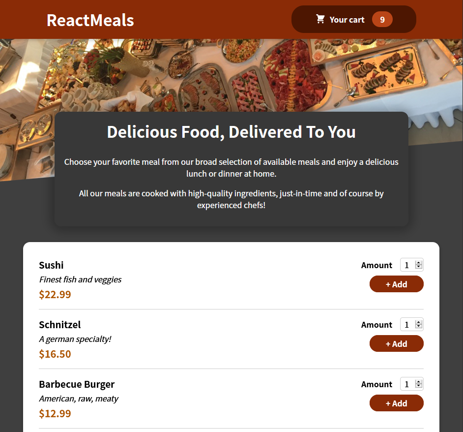
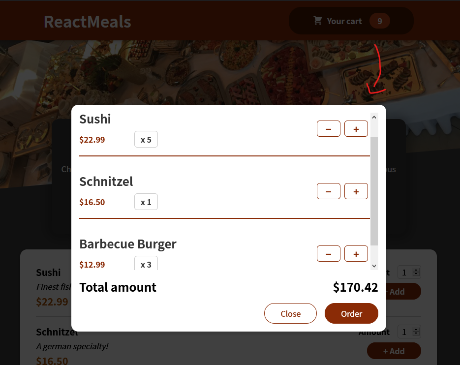

# react-course-webapp-5
Section 11: Practice Project: Building a Food Order App

**Lag en food order app som:**
- lister opp meals
- kan legge meals til cart
- viser cart med meals
- kan redigere cart (endre antallet meals)

Webapp

Cart modal

