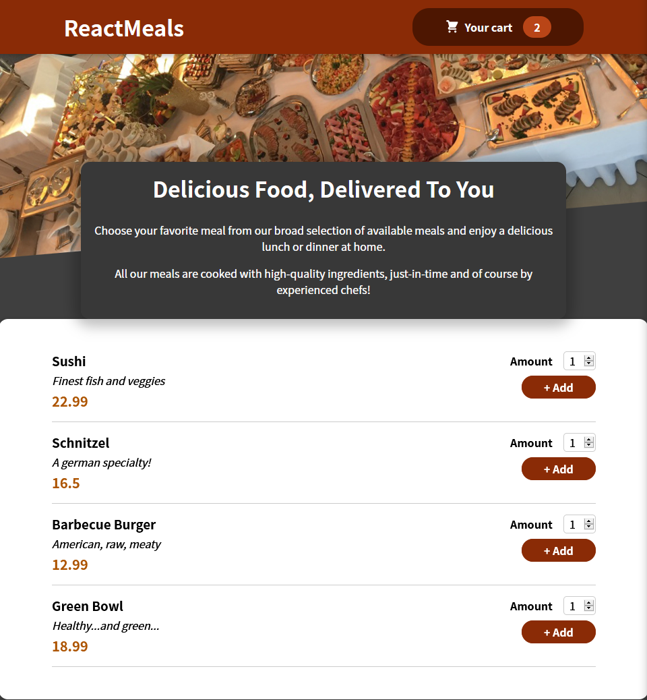

# practise project

## Oppgaven
Lag en Food Order App som:
- lister opp meals
- viser frem handlekurv
- gjør det mulig å legge meals til handlekurv
- gjør det mulig å redigere handlekurv (legge til og fjerne antall meals)

Ferdig app som vist i video

Dette prosjektet går gjennom tema som vi har gått gjennom tidligere, og kombinerer det sammen i et større prosjekt.

## Min progresjon

### 2

Min app, så langt

### 1 ([commit](https://github.com/paalss/react-course-webapp-5/tree/26b44890201c2c7971bb368cc9715a241bb139b5))
Har blitt tildelt en del CSS- og noen JS-filer. Unvervisningsvideoen foreslo at jeg kunne prøve å kode så mye av løsningen som mulig, uten å se på "fasit-videoene".\
Jeg gjorde nettopp det. Har for det meste opprettet JS-filer med komponenter basert på CSS-filene og bygget på GUI-et.

Min app, så langt