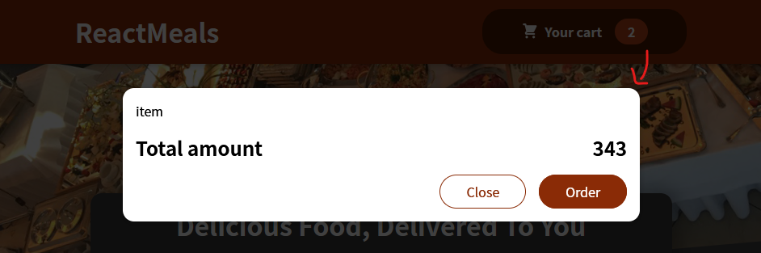

# practise project

## Oppgaven
Lag en Food Order App som:
- lister opp meals
- viser frem cart
- gjør det mulig å legge meals til cart
- gjør det mulig å redigere cart (legge til og fjerne antall meals)

Ferdig app som vist i video

Dette prosjektet går gjennom tema som vi har gått gjennom tidligere, og kombinerer det sammen i et større prosjekt.

## Min progresjon

### 4 ([commit]())

Man kan legge til meals i cart, se lagt til meals og endre antallet. "Order" button vises kun om det ligger noen meals i cart. Total pris endres også.

### 3 ([commit](https://github.com/paalss/react-course-webapp-5/tree/e55300553d7047c51c6915ff9e4b6fe0babeb60e))

Legger til Cart Modal (komponent som bruker UI komponent modal). Header knapp (HeaderCartButton) får tilsendt en funksjon (showCartHandler) som lar App rendre Cart. Cart får selv tilsendt funksjon (hideCartHandler) for å ikke rendres av App.

"Legger til Cart Modal. Se mer i README punkt 3"

### 2 ([commit](https://github.com/paalss/react-course-webapp-5/tree/aca95b197641b1dc6430c60cbdb96a0d4706e7d1))

"Brukergrensesnitt etter å ha fulgt videoer. Litt omstrukturering: ting legges i andre mappestrukturer. UI/Input.js gjøres mer configable med props (det gir jo mening)."

"måtte følge video for å få til header-bildet. Bruker import for å hente inn lokalt bilde. De fleste GUI elementene er på plass."

### 1 ([commit](https://github.com/paalss/react-course-webapp-5/tree/26b44890201c2c7971bb368cc9715a241bb139b5))

"bygger så mye av appen som mulig på egenhånd. Har fått til en del grafiske elementer. Se mer i README"

Har blitt tildelt en del CSS- og noen JS-filer. Unvervisningsvideoen foreslo at jeg kunne prøve å kode så mye av løsningen som mulig, uten å se på "fasit-videoene".\
Jeg gjorde nettopp det. Har for det meste opprettet JS-filer med komponenter basert på CSS-filene og bygget på GUI-et.
